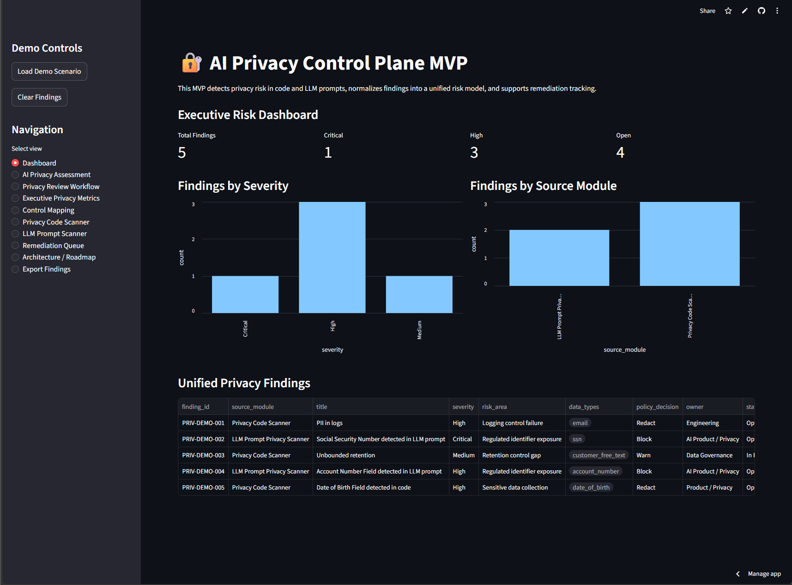
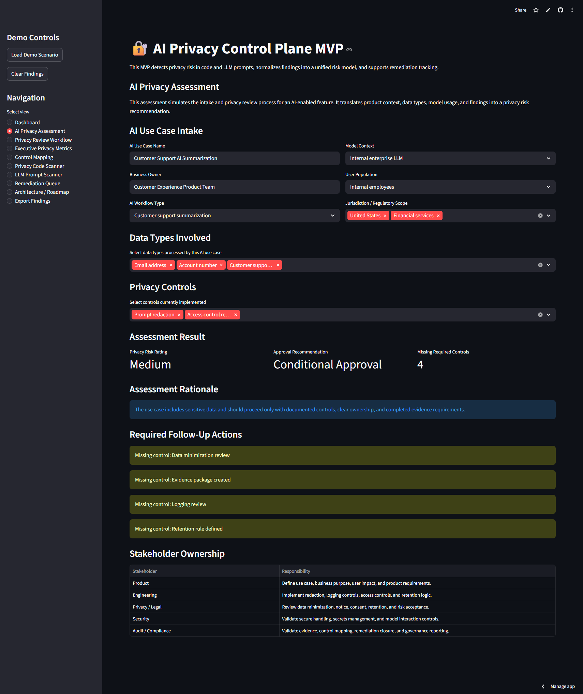
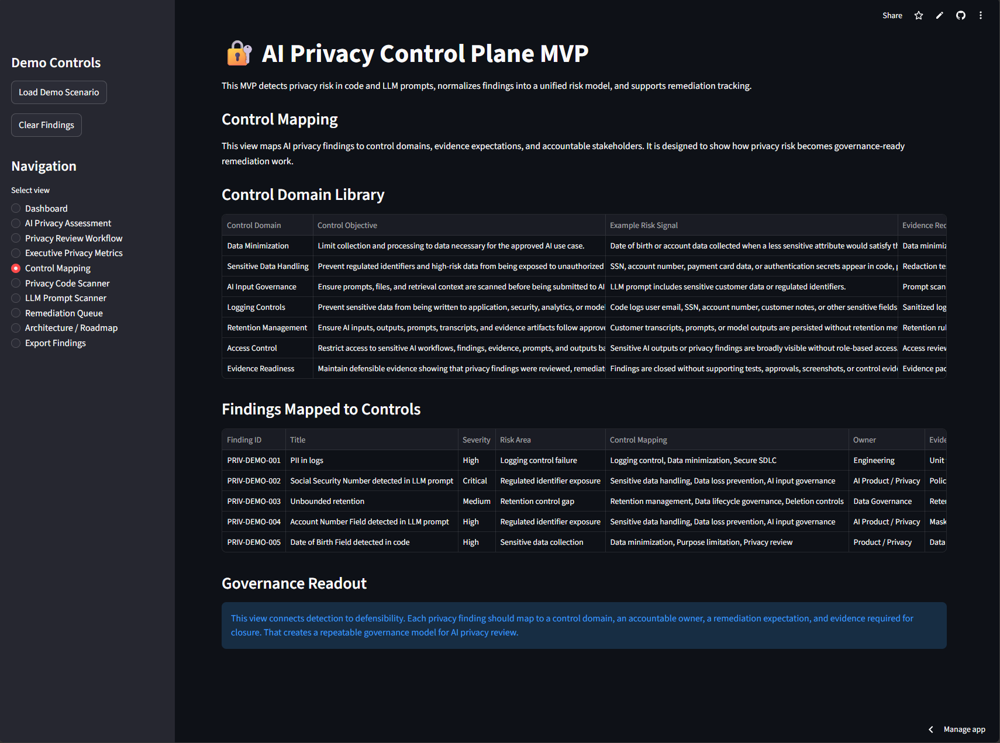

# AI Privacy Control Plane MVP

## Live Demo

[Launch the AI Privacy Control Plane MVP](https://ai-privacy-control-plane.streamlit.app/)

## Overview

AI Privacy Control Plane is a portfolio MVP that demonstrates how privacy risk can be operationalized inside AI-enabled product and engineering workflows.

The MVP scans application code and LLM prompts for privacy risk, normalizes findings into a unified risk model, routes findings into a remediation queue, and supports exportable evidence for stakeholder review.

## Business Problem

AI-enabled systems can create privacy risk when sensitive data is collected, logged, retained, or sent to an LLM without proper controls.

Common risk scenarios include:

- PII appearing in application logs
- Regulated identifiers appearing in prompts
- Sensitive customer data sent to AI systems without redaction
- Date of birth or account data collected without clear minimization
- Privacy findings lacking ownership, remediation steps, or evidence requirements

## Screenshots

### Executive Dashboard



### AI Privacy Assessment



### Control Mapping



## MVP Capabilities

| Capability | Description |
|---|---|
| AI Privacy Assessment | Simulates privacy intake, data classification, control review, risk rating, approval recommendation, and stakeholder ownership for an AI use case |
| Privacy Review Workflow | Shows the end-to-end AI privacy review process from intake through data classification, scanning, triage, remediation, evidence collection, and approval |
| Executive Privacy Metrics | Translates privacy findings into program-level metrics for leadership, governance, compliance reporting, and cross-functional execution |
| Control Mapping | Maps AI privacy findings to control domains, evidence expectations, remediation ownership, and governance-ready closure requirements |
| Privacy Code Scanner | Detects privacy anti-patterns in code snippets or pull request diffs |
| LLM Prompt Scanner | Detects and redacts sensitive data before LLM processing |
| Executive Dashboard | Shows findings by severity, source module, and open risk count |
| Remediation Queue | Converts findings into owner-aligned remediation work |
| Architecture / Roadmap | Shows current MVP architecture and future platform direction |
| Export Findings | Exports findings to CSV for review, tracking, or evidence workflows |
| Demo Scenario Loader | Loads a stable demo scenario for walkthroughs |

## Current MVP Architecture

```text
Privacy Code Scanner ┐
                     ├── Standard Finding Model ── Executive Dashboard ── Remediation Queue
LLM Prompt Scanner   ┘
```

## Target Platform Architecture

```text
GitHub / PR Diffs       ┐
LLM Gateway             ├── Privacy Signal Modules ── Policy Engine ── Unified Risk Model
SOC Reports             │                                      │
Vendor Reviews          │                                      ├── Executive Dashboard
Data Flow Mapper        ┘                                      ├── Remediation Queue
                                                                └── Evidence Repository
```

## Tech Stack

- Python
- Streamlit
- Pandas
- Regex-based detection logic
- Session-state demo workflow

## How to Run Locally

Create a virtual environment:

```bash
python -m venv .venv
```

Activate the environment:

```powershell
.venv\Scripts\Activate.ps1
```

Install dependencies:

```bash
pip install -r requirements.txt
```

Run the app:

```bash
streamlit run app.py
```

## Demo Flow

1. Click **Load Demo Scenario**.
2. Open the **Dashboard**.
3. Show findings by severity and source module.
4. Open the **Privacy Code Scanner** and scan the sample code.
5. Open the **LLM Prompt Scanner** and scan the sample prompt.
6. Open the **Remediation Queue** to show ownership, remediation, and evidence requirements.
7. Open **Architecture / Roadmap** to explain the platform strategy.
8. Open **Export Findings** to show exportable audit and remediation evidence.

## Product and Operating Model

This MVP is intentionally narrow, but the operating model is scalable.

The project demonstrates how privacy, security, legal, audit, product, and engineering concerns can be translated into a practical delivery system:

- Detect privacy risk in code and AI workflows
- Normalize findings into a consistent risk model
- Assign accountable ownership
- Prioritize remediation by severity and policy decision
- Track evidence required for defensible closure
- Support future integration with GitHub, Jira, SOC reports, data-flow mapping, and vendor assurance

The broader platform vision is a modular AI privacy control plane that turns privacy obligations into actionable engineering workflows, measurable risk reduction, and audit-ready evidence.

## Supporting Strategy Documents

| Document | Purpose |
|---|---|
| [Product Strategy Brief](docs/product_strategy_brief.md) | Explains the product vision, target users, operating model, key metrics, roadmap, risks, and tradeoffs |
| [Customer Support AI Case Study](docs/case_study_customer_support_ai.md) | Walks through a representative AI use case from privacy intake through risk assessment, remediation, control mapping, and decisioning |
| [Demo Script](docs/demo_script.md) | Provides a structured walkthrough for the live demo |

## Roadmap

| Phase | Capability | Business Outcome |
|---|---|---|
| Phase 1 | GitHub PR integration | Scan privacy risk before code is merged |
| Phase 2 | SOC report extractor | Extract CUECs, exceptions, and physical/environmental controls |
| Phase 3 | Jira integration | Convert privacy findings into accountable remediation tickets |
| Phase 4 | Data flow mapper | Map systems, data types, AI usage, vendors, and retention rules |
| Phase 5 | Evidence repository | Support privacy reviews, audits, and customer assurance |
| Phase 6 | Executive reporting | Track risk reduction, aging, SLAs, repeat findings, and control maturity |